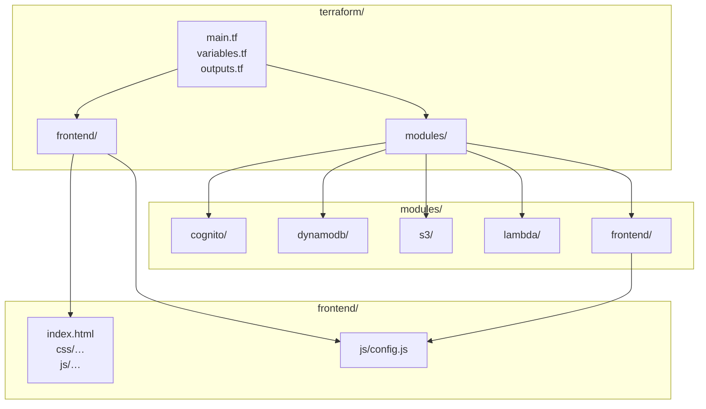

# AWS Image Translation Pipeline - Terraform Infrastructure

> **Infrastructure as Code for AWS AI/ML Translation Services**
> Automated provisioning and management of AWS resources for image text extraction, language detection, and translation pipeline using Terraform.

This directory contains simplified Terraform configuration for deploying AWS infrastructure for the image translation pipeline.

## Troubleshooting

**Common Setup Issues:**

1. **S3 bucket name conflicts**: Choose a globally unique bucket name in `terraform.tfvars`
2. **AWS credentials**: Ensure `aws configure` has proper permissions for creating IAM roles, DynamoDB tables, and S3 buckets
3. **Terraform not found**: Install Terraform from [terraform.io](https://terraform.io) and ensure it's in your PATH

**Required AWS Permissions:**

Your AWS credentials need the following permissions:

- `s3:CreateBucket`, `s3:PutBucketPolicy`, `s3:PutBucketEncryption`
- `dynamodb:CreateTable`, `dynamodb:DescribeTable`
- `iam:CreateRole`, `iam:CreatePolicy`, `iam:AttachRolePolicy`
- `lambda:CreateFunction` (if deploying Lambda functions)

## 🏗️ What This Creates

- **DynamoDB Table**: `reddit_ingest_state` for tracking Reddit post processing state
- **S3 Bucket**: Secure storage for images with encryption, versioning, and lifecycle rules
- **IAM Role & Policy**: Application permissions for accessing DynamoDB, S3, Rekognition, and Translate services

## 🔧 Architecture Overview



## 📋 Prerequisites

1. **AWS CLI configured** with appropriate credentials (`aws configure`)
2. **Terraform installed** (>= 1.0) - Available at [terraform.io](https://terraform.io)
3. **Unique S3 bucket name** (S3 bucket names must be globally unique)
4. **Python 3.8+** for running the cleanup script (actively tested with Python 3.13.2)

## 🚀 Quick Start

1. **Edit the variables file:**

   ```bash
   # Edit terraform/terraform.tfvars
   # Update s3_bucket_name to something globally unique
   # Your Reddit API credentials are already set up
   ```

2. **Initialize Terraform:**

   ```bash
   cd terraform
   terraform init
   ```

3. **Plan the deployment:**

   ```bash
   terraform plan
   ```

4. **Apply the infrastructure:**

   ```bash
   terraform apply
   ```

## 🛠️ Using the Deploy Scripts (Recommended)

Instead of running terraform commands directly, you can use the deployment scripts:

**Windows (PowerShell):**

```powershell
.\deploy.ps1 -Action init
.\deploy.ps1 -Action plan
.\deploy.ps1 -Action apply
```

**Linux/Mac:**

```bash
./deploy.sh init
./deploy.sh plan
./deploy.sh apply
```

## ⚙️ Configuration

Your `terraform.tfvars` should be configured with:

```hcl
aws_region = "us-east-1"
dynamodb_table_name = "reddit_ingest_state"
s3_bucket_name = "your-globally-unique-bucket-name"  # MUST be globally unique!

# Reddit API credentials (synchronized with .env.local)
reddit_client_id     = "your_reddit_client_id"
reddit_client_secret = "your_reddit_client_secret"
reddit_user_agent    = "python:translate-images-bot:1.0 (by u/your_username)"
```

**Important:**

- S3 bucket names must be globally unique across all AWS accounts
- Reddit credentials should match those in your `.env.local` file
- These values are synchronized with your Python `config.py` file

## Security Features

✅ **S3 Security:**

- Public access blocked
- Server-side encryption (AES256)
- Versioning enabled
- Lifecycle rules for cost optimization

✅ **DynamoDB Security:**

- Server-side encryption enabled
- Point-in-time recovery enabled

✅ **IAM Security:**

- Least privilege access
- Specific resource permissions only

## Cleanup

To destroy all resources and avoid ongoing costs:

```bash
terraform destroy
# or
./deploy.sh destroy
```

## File Structure

```text
terraform/
├── main.tf                # Main infrastructure configuration
├── variables.tf           # Input variables
├── outputs.tf            # Output values
├── data.tf               # Data sources
├── terraform.tfvars      # Your actual values (configured)
├── terraform.tfvars.example  # Template for new setups
├── deploy.sh             # Bash deployment script
├── deploy.ps1            # PowerShell deployment script
└── modules/              # Reusable modules
    ├── dynamodb/         # DynamoDB table module
    └── s3/               # S3 bucket module
```

## Additional Resources

### Useful Commands

```bash
# Check what will be created/changed
terraform plan

# Check current state
terraform show

# View outputs after deployment
terraform output

# Validate configuration
terraform validate

# Check current workspace and state
terraform workspace show
terraform state list
```

## Integration with Python Application

After deploying, your resources will match your Python `config.py`:

```python
# These values should be synchronized between terraform.tfvars and config.py:
S3_IMAGE_BUCKET = "your-globally-unique-bucket-name"  # From terraform.tfvars
DYNAMODB_TABLE_NAME = "reddit_ingest_state"          # From terraform.tfvars
AWS_REGION = "us-east-1"                             # From terraform.tfvars

# Reddit API credentials are managed via environment variables
REDDIT_CLIENT_ID = os.getenv("REDDIT_CLIENT_ID")
REDDIT_CLIENT_SECRET = os.getenv("REDDIT_CLIENT_SECRET")
REDDIT_USER_AGENT = os.getenv("REDDIT_USER_AGENT")
```

The infrastructure is designed to work seamlessly with your existing Python application configuration, including enhanced media processing and subreddit scraping capabilities.
