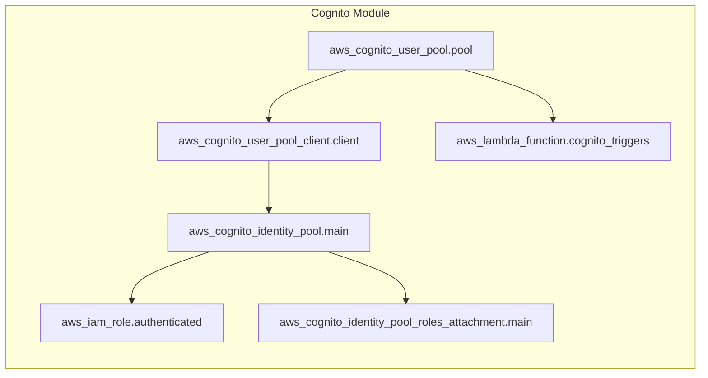

# Cognito Module Architecture

```mermaid
flowchart TB
  subgraph Cognito Module
    direction TB
    A[aws_cognito_user_pool.pool]
    B[aws_cognito_user_pool_client.client]
    C[aws_cognito_identity_pool.main]
    D[aws_iam_role.authenticated]
    E[aws_cognito_identity_pool_roles_attachment.main]
    F[aws_lambda_function.cognito_triggers]
  end
  A --> B
  B --> C
  C --> D
  C --> E
  A --> F
```
