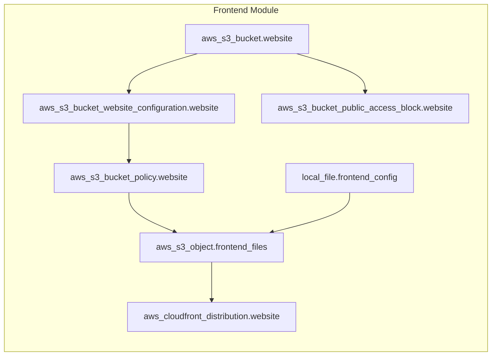

# Frontend Module Architecture

```mermaid
flowchart TB
  subgraph Frontend Module
    direction TB
    A[aws_s3_bucket.website]
    B[aws_s3_bucket_website_configuration.website]
    C[aws_s3_bucket_public_access_block.website]
    D[aws_s3_bucket_policy.website]
    E[aws_s3_object.frontend_files]
    F[aws_cloudfront_distribution.website]
    G[local_file.frontend_config]
  end
  A --> B
  A --> C
  B --> D --> E --> F
  G --> E
```
