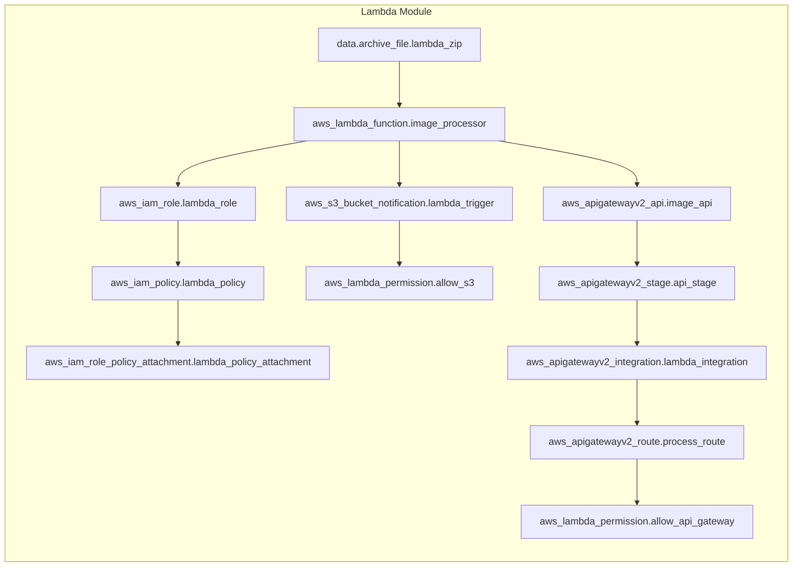

# Lambda Module Architecture

```mermaid
flowchart TB
  subgraph Lambda Module
    direction TB
    A[data.archive_file.lambda_zip]
    B[aws_lambda_function.image_processor]
    C[aws_iam_role.lambda_role]
    D[aws_iam_policy.lambda_policy]
    E[aws_iam_role_policy_attachment.lambda_policy_attachment]
    F[aws_s3_bucket_notification.lambda_trigger]
    G[aws_lambda_permission.allow_s3]
    H[aws_apigatewayv2_api.image_api]
    I[aws_apigatewayv2_stage.api_stage]
    J[aws_apigatewayv2_integration.lambda_integration]
    K[aws_apigatewayv2_route.process_route]
    L[aws_lambda_permission.allow_api_gateway]
  end
  A --> B --> C --> D --> E
  B --> F --> G
  B --> H --> I --> J --> K --> L
```
