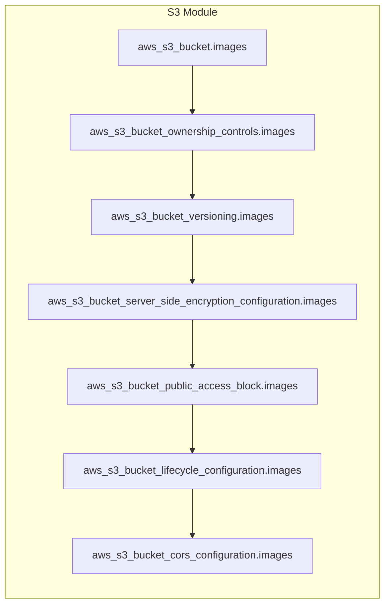

# S3 Module Architecture

```mermaid
flowchart TB
  subgraph S3 Module
    direction TB
    A[aws_s3_bucket.images]
    B[aws_s3_bucket_ownership_controls.images]
    C[aws_s3_bucket_versioning.images]
    D[aws_s3_bucket_server_side_encryption_configuration.images]
    E[aws_s3_bucket_public_access_block.images]
    F[aws_s3_bucket_lifecycle_configuration.images]
    G[aws_s3_bucket_cors_configuration.images]
  end
  A --> B --> C --> D --> E --> F --> G
```
